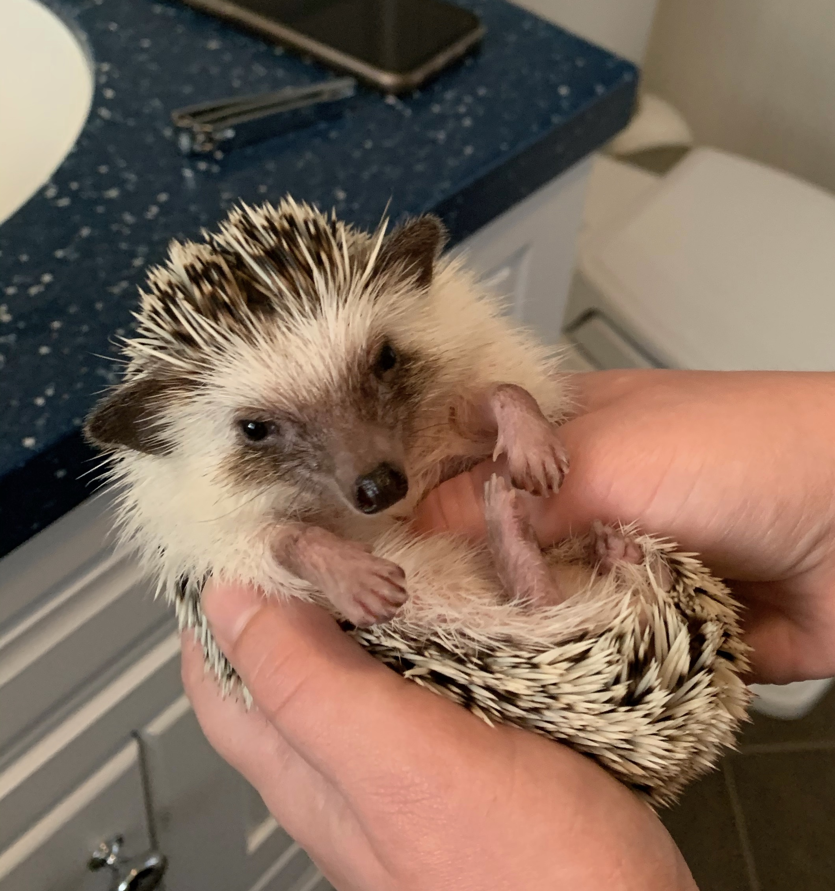

## Publications
* [What Policing Costs: A Look at Spending in America's Biggest Cities](https://www.vera.org/publications/what-policing-costs-in-americas-biggest-cities)
* [The Dehumanization of Immigrants and Refugees: A Comparison of Dehumanizing Rhetoric by All Candidates in Three U.S. Presidential Elections](http://dx.doi.org/https://doi.org/10.5703/1288284316932)
* [Helping Parents Navigate the Child Welfare System: Partnering with CASA to Create Self-Advocacy Resource Kits](https://docs.lib.purdue.edu/pjsl/vol6/iss1/12/)

## Graduate Student Activities
* Sexual Health Action Group (Executive Board)
* Southern Border Action Group at Columbia Mailman
* Intersex Justice Coalition
* Addiction Information & Management Strategies Council
* Students for Sensible Drug Policy
* American Public Health Association

## Pets
### Gracie

### Riley

### Skrimmer

### Appa

### Betty
